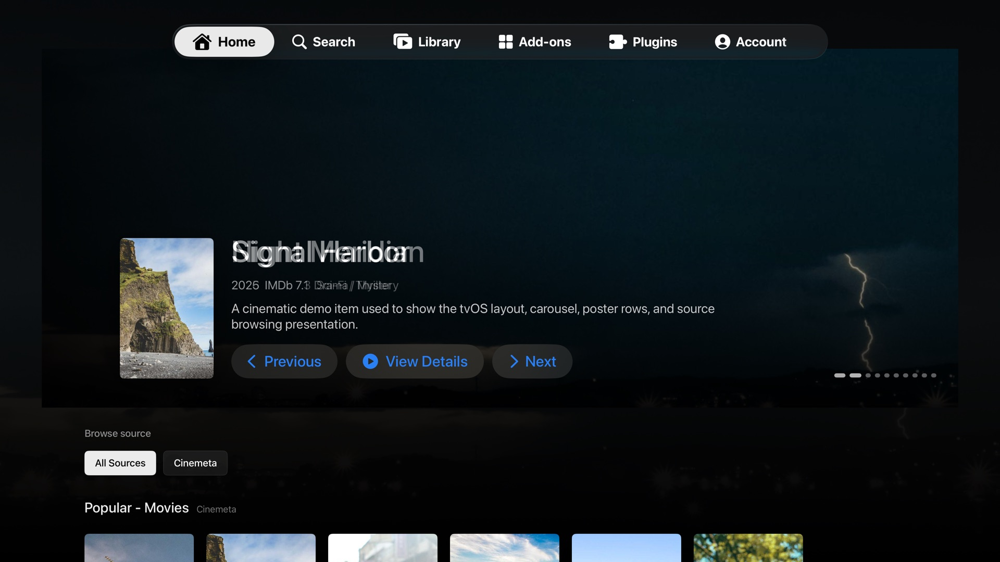

# NuvioTV tvOS

This folder contains a native SwiftUI tvOS target for sideloading on Apple TV.

The Android app cannot be converted directly because it depends on Android-only components: Jetpack Compose, ExoPlayer/Media3, Android AARs, JNI `.so` libraries, and Android storage/runtime APIs. This target is a clean native tvOS app that reuses Nuvio branding and provides Apple TV remote navigation, Nuvio account login, synced add-ons, catalog browsing, search, source selection, and playback.



## Current features

- Nuvio account login with email/password and TV code login.
- Synced add-on loading from the Nuvio backend.
- Edge-to-edge rotating home carousel with synced catalog rows.
- Home catalogs, search, item details, season-aware episode selection, and stream/source selection.
- Episode previews with thumbnails, episode numbers, titles, and descriptions when add-ons expose metadata.
- Remote-friendly add-on management: add, edit URL, reload, enable/disable, and remove.
- Source metadata badges for quality, container, size, and seed information when providers expose it.
- Native AVPlayer playback for HLS/MP4/web-ready sources.
- VLC fallback playback through TVVLCKit for MKV/WebM/AVI and other sources that AVPlayer cannot decode directly.
- VLC player overlay with timeline, play/pause, skip back/forward, audio tracks, and subtitle tracks.

## Player remote controls

For native AVPlayer streams, Apple TV's built-in player controls are used.

For VLC fallback streams:

- Press Down to show the timeline and controls.
- Press Left/Right to seek backward/forward.
- Press Play/Pause to toggle playback.
- Press Back/Menu once to hide controls.
- Press Back/Menu again to exit playback.

## Account sync

The tvOS target uses the same Supabase backend contract as the Android app:

- Supabase email/password auth through `/auth/v1/token?grant_type=password`
- TV login RPCs: `start_tv_login_session`, `poll_tv_login_session`, and `tv-logins-exchange`
- Sync RPCs: `get_sync_overview` and `sync_pull_library`

The default hosted backend values come from the public Nuvio web environment at `https://web.nuvioapp.space/nuvio.env.js`. They can be edited from the tvOS Settings screen if the backend changes.

## Build and sideload

1. Open `NuvioTV.xcodeproj` in Xcode.
2. Select the `NuvioTV` target.
3. Set your signing team in **Signing & Capabilities**.
4. Choose your Apple TV as the run destination.
5. Press **Run**.

The default bundle identifier is `com.anshumanbiswas.nuvio.tvos`. Change it in Xcode if your team requires a different identifier.

## Signed IPA

Apple TV will reject unsigned or ad-hoc signed IPAs with `0xe8008014` / "invalid signature". Build a sideloadable IPA with an Apple Development team:

```bash
DEVELOPMENT_TEAM=YOURTEAMID ./scripts/build_signed_ipa.sh
```

The signed IPA is written to:

```bash
dist/NuvioTV-tvOS-signed.ipa
```

`DEVELOPMENT_TEAM` is not your Apple ID email. It is the 10-character Apple Developer Team ID shown in **Xcode > Settings > Accounts** after you add your Apple ID and select a team. Xcode must also have an Apple Development signing certificate available for that team.

Do not publish a personal signed IPA publicly. Development-signed IPAs are tied to a specific Apple Developer team, provisioning profile, and registered devices. Other users should build and sign their own IPA from source.

## Local verification

```bash
xcodebuild -project NuvioTV.xcodeproj -scheme NuvioTV -destination 'platform=tvOS Simulator,name=Apple TV' build
xcodebuild test -project NuvioTV.xcodeproj -scheme NuvioTV -destination 'platform=tvOS Simulator,name=Apple TV' CODE_SIGNING_ALLOWED=NO
```

If Xcode reports that the tvOS platform is not installed, install it from **Xcode > Settings > Components**, then rerun the commands.

To capture repository screenshots with representative sample rows:

```bash
xcrun simctl launch booted com.anshumanbiswas.nuvio.tvos --demo-content
xcrun simctl io booted screenshot docs/screenshots/home.png
sips -Z 1920 -s format jpeg -s formatOptions 82 docs/screenshots/home.png --out docs/screenshots/home.jpg
```

## Known gaps

1. VLC fallback controls are functional but not yet identical to the iPad/macOS player UI.
2. External subtitle loading is not yet exposed; embedded VLC subtitle tracks are selectable.
3. Some provider streams may still fail if the upstream source blocks Apple TV networking or requires provider-specific headers that are not exposed by the add-on response.
